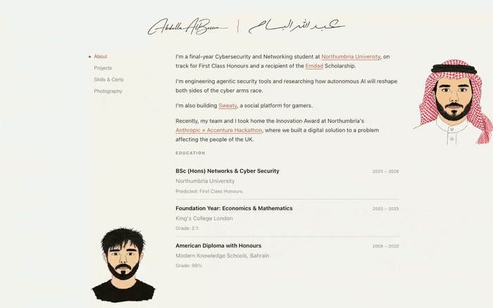

# Personal Portfolio

My personal portfolio website built with Astro, Svelte, and Tailwind CSS.

<p align="center">
  <a href="https://abdullaalbassam.com">
    
  </a>
</p>

Live at [abdullaalbassam.com](https://abdullaalbassam.com).

## Tech Stack

- **Framework:** [Astro](https://astro.build) v4 — static site generation with island architecture
- **UI Components:** [Svelte](https://svelte.dev) v5 — interactive islands (nav, animations, forms)
- **Styling:** [Tailwind CSS](https://tailwindcss.com) v3 — utility-first CSS
- **Deployment:** [Vercel](https://vercel.com)
- **Language:** TypeScript

## Project Structure

```
src/
├── assets/          # Images, fonts, static assets
├── components/      # Svelte + Astro components
├── content/
│   └── blog/        # Markdown blog posts (ready for future use)
├── layouts/         # Base page layouts
├── pages/           # Route pages
└── styles/          # Global CSS
public/
├── cv.pdf           # Downloadable resume
├── favicon.svg      # Site favicon
└── robots.txt       # Search engine directives
```

## Development

```bash
npm install        # Install dependencies
npm run dev        # Start dev server at localhost:4321
npm run build      # Production build
npm run preview    # Preview production build locally
```

## Adding Blog Posts

Create a `.md` file in `src/content/blog/`:

```markdown
---
title: "My First Post"
description: "A brief description"
pubDate: 2024-01-15
tags: ["cybersecurity", "networking"]
---

Your content here...
```

## Design

Check out both V1 and V2!

## License

MIT
